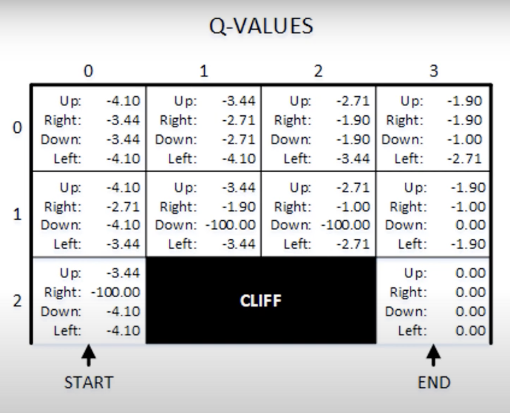
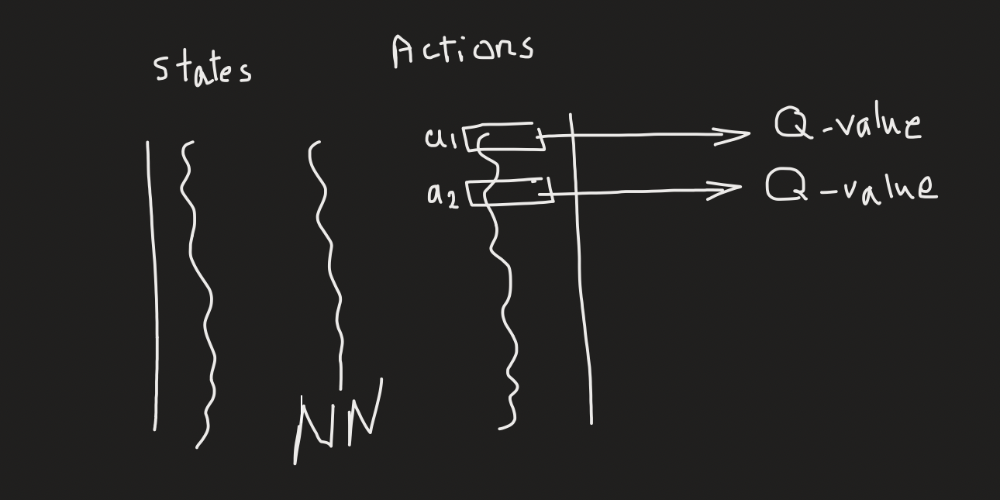

## From Tabular Q Learning to Deep Q Learning

Check [This](https://www.youtube.com/watch?v=ECV5yeigZIg&t=5s)
Check [This](https://www.youtube.com/watch?v=cO5g5qLrLSo&list=PLgNJO2hghbmjlE6cuKMws2ejC54BTAaWV&index=2)

- In Q-learning, the Q-values of all states for each action is maintained in a table called Q-table.
  - Example is for the Cliff problem. Check the image.

- In each iteration, we update the Q-values.
- In the final converged Q-table, for each state, it is clear which action provides the highest Q-value to the end of the network.
- In Deep Learning, we replace the Q-Table with a Neural Network model. When the model is trained, then for each State, it shows which Action has the highest Q-value.
- For training in NN:
  - Input: States
  - Output: Q- values of various actions

- The Policy action is the one with the highest predicted Q-values.